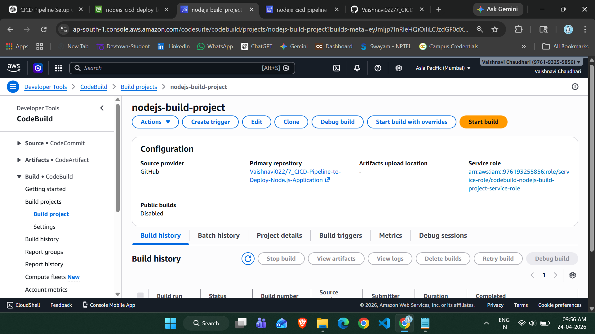
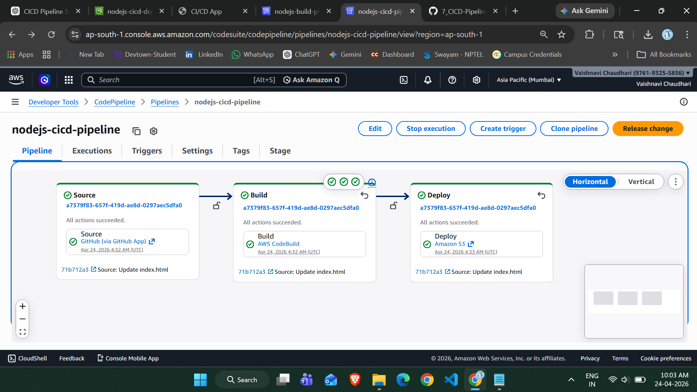
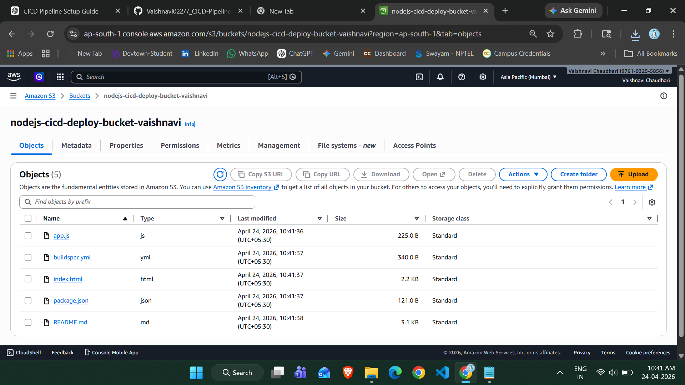
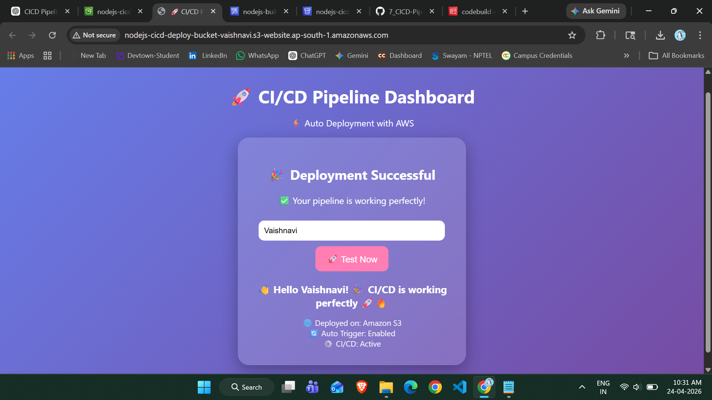

# 🚀 CI/CD Pipeline to Deploy Node.js Application (AWS)

## 📌 Project Overview

This project demonstrates a complete **CI/CD pipeline using AWS services** to automatically deploy a Node.js (static frontend) application whenever code is updated in GitHub.

The pipeline integrates:

* GitHub (Source)
* AWS CodePipeline
* AWS CodeBuild
* Amazon S3 (Deployment)

---

## 🎯 Objective

* Automate deployment on every code change
* Build a real-world DevOps pipeline
* Host a live web application using AWS

---

## 🧰 AWS Services Used

* **Amazon S3** → Static website hosting
* **AWS CodePipeline** → CI/CD orchestration
* **AWS CodeBuild** → Build & deployment
* **GitHub** → Source repository

---

## 🏗️ Architecture Flow

```
GitHub → CodePipeline → CodeBuild → Amazon S3
```

---

## 📁 Project Structure

```
├── index.html
├── app.js
├── package.json
├── buildspec.yml
└── README.md
```

---

## ⚙️ Step-by-Step Implementation

### 1️⃣ Create S3 Bucket

* Create bucket: `nodejs-cicd-deploy-bucket-vaishnavi`
* Enable **Static Website Hosting**
* Set:

  * Index document: `index.html`

---

### 2️⃣ Upload Project to GitHub

* Push project files to GitHub repository
* Example repo:

```
7_CICD-Pipeline-to-Deploy-Node.js-Application
```

---

### 3️⃣ Create CodeBuild Project

* Source: GitHub
* Environment: Managed Image
* Runtime: Node.js
* Attach IAM role with S3 access

---

### 4️⃣ Configure buildspec.yml

```yaml
version: 0.2

phases:
  install:
    commands:
      - echo "Installing..."
  build:
    commands:
      - echo "Build complete"

artifacts:
  files:
    - '**/*'
```

---

### 5️⃣ Create CodePipeline

#### Source Stage:

* Provider: GitHub
* Branch: main

#### Build Stage:

* Provider: CodeBuild

#### Deploy Stage:

* Provider: Amazon S3
* Enable: **Extract file before deploy**

---

### 6️⃣ Fix Permissions

Add IAM policy to CodeBuild role:

```json
{
  "Effect": "Allow",
  "Action": "s3:*",
  "Resource": "*"
}
```

---

### 7️⃣ Run Pipeline

* Click **Release Change**
* Verify all stages:

  * Source ✅
  * Build ✅
  * Deploy ✅

---

## 📸 Screenshots

### 🔹 1. CodeBuild Project



### 🔹 2. CodePipeline Execution



### 🔹 3. S3 Bucket Files



---

## 🌐 Final Output (Live Website)



---

## 🎉 Result

* CI/CD pipeline successfully implemented
* Automatic deployment working
* Static website hosted on S3
* Modern UI with emojis displayed

---

## 💡 Key Learnings

* CI/CD pipeline architecture
* AWS service integration
* IAM permission handling
* Debugging deployment issues
* S3 static hosting

---

## 🚀 Future Improvements

* Deploy backend using EC2
* Add CloudFront CDN
* Add custom domain
* Integrate database

---

## 👩‍💻 Author

**Disha (Vaishnavi Chaudhari)**
AWS + DevOps Enthusiast 🚀

---

## 📌 Note

Only main output and successful pipeline are shown in README.
Other screenshots are stored inside:

```
images/placeholder.txt
```
